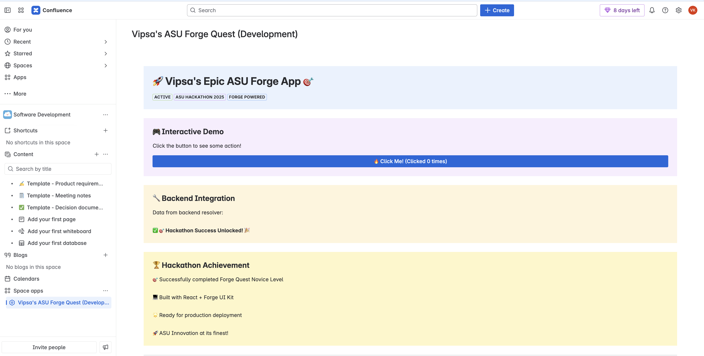

# 🚀 Vipsa's Forge App on confluence

**Atlassian June 2025 Hackathon Submission**

This project demonstrates the power of Atlassian Forge by creating a feature-rich Confluence space page application. The app combines frontend interactivity with backend functionality to deliver a seamless user experience within the Atlassian confluence ecosystem.



## 🚀 Getting Started

### Prerequisites

- Node.js 20+
- Atlassian Developer Account
- Forge CLI installed globally

### Installation

1. **Clone and Setup**

   ```bash
   git clone [your-repo-url]
   cd asu-forge-quest
   npm install
   ```

2. **Login to Forge**

   ```bash
   forge login
   ```

3. **Deploy to Development**

   ```bash
   forge deploy
   ```

4. **Install on Confluence Site**
   ```bash
   forge install
   ```

## 📁 Project Structure

```
asu-forge-quest/
├── src/
│   ├── frontend/
│   │   └── index.jsx          # React frontend components
│   ├── resolvers/
│   │   └── index.js           # Backend resolver functions
│   └── index.js               # Main entry point
├── manifest.yml               # Forge app configuration
├── package.json              # Dependencies and scripts
└── README.md                 # This file
```

## 🏆 Hackathon Submission

**Event**: Atlassian June 2025 Hackathon  
**Category**: Forge Development  
**Completion Date**: June 19, 2025  
**Status**: ✅ Successfully Deployed and Functional

---

_Built with ❤️ for the Atlassian Developer Community_
